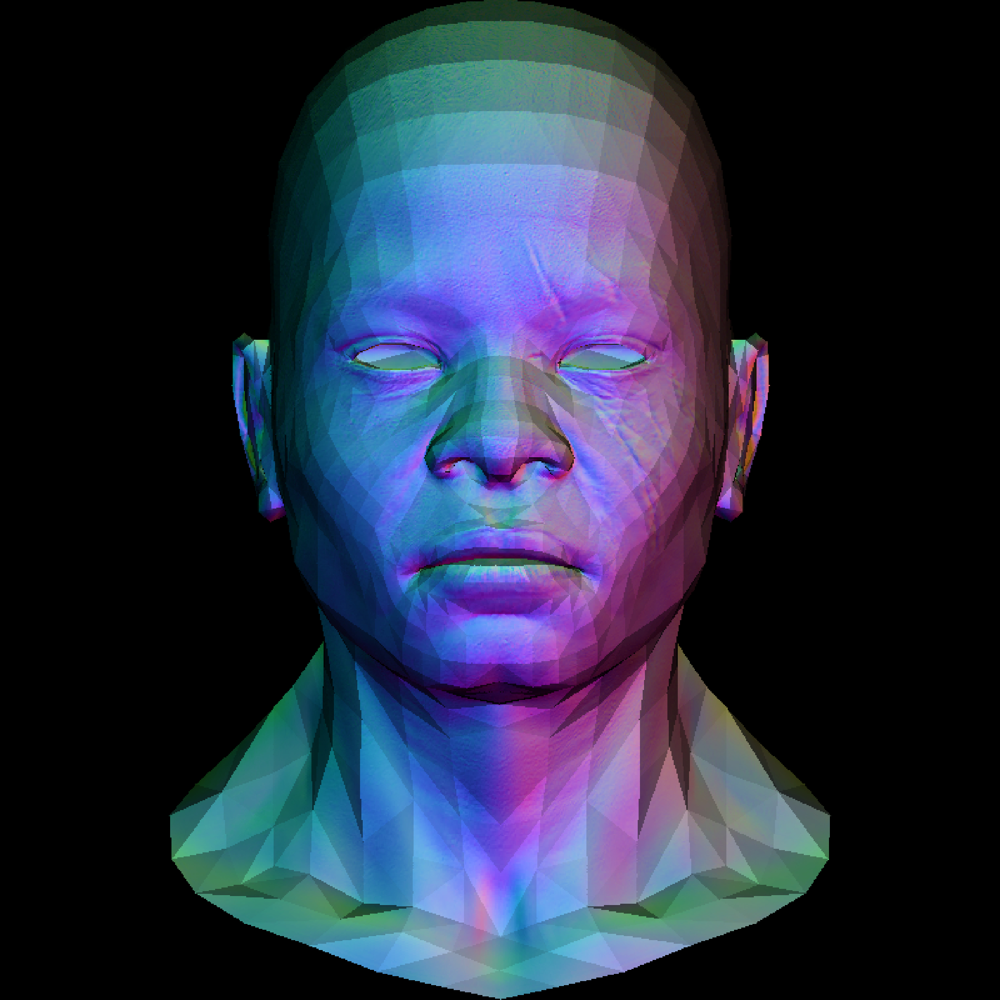

Software Renderer from Scratch

## Table of Contents

1. [Introduction](#introduction)
2. [Getting Started](#getting-started)
   - [Prerequisites](#prerequisites)
   - [Installation](#installation)
3. [Usage](#usage)
   - [Example Rendering](#example-rendering)
4. [Features](#features)
5. [Architecture](#architecture)
6. [Contributing](#contributing)
7. [License](#license)
8. [Acknowledgments](#acknowledgments)

## Introduction

The "Software Renderer from Scratch" is a C++ project dedicated to implementing a basic software renderer without relying on external graphics libraries. The primary goal is to offer a simple yet functional renderer for educational purposes, providing an opportunity to delve into the fundamentals of computer graphics.

This project revolves around the visualization of 3D models using the Wavefront OBJ file format. Wavefront OBJ files serve as the input for the software renderer, providing information about the geometry and attributes of 3D models. Additionally, TGA (Truevision Graphics Adapter) files are employed for visualization and texture mapping, offering a means to observe the rendered output of the software renderer.

## Getting Started

### Prerequisites

Before using the software renderer, make sure you have the following prerequisites installed:

- C++ compiler (e.g., g++, Visual C++)
- Standard Template Library (STL) support
- [spdlog](https://github.com/gabime/spdlog) library for logging

### Installation

To install and build the project, follow these steps:

1. Clone the repository:
   ```bash
   git clone https://github.com/martinlejko/simple-software-renderer.git
   cd software-renderer
   ```
2. Install the spdlog
3. Build it and run the main.cpp :)

### Usage

To use the software renderer, follow these steps:

```bash
./simple-software-renderer [OPTIONS]
```

#### Options

    -model [model_file]: Required. Specifies the input model file path.
    -texture [texture_file]: Optional for some functions needed. Specifies the texture file.
    -zbuffer: Optional. Enables z-buffering.
    -lightdirection [x,y,z]: Optional. Specifies the direction of the light source. Expected format: -lightdirection "x,y,z".
    -drawtype [lines|colortriangle|texture|light]: Required. Specifies the type of drawing to perform. Available options: lines, colortriangle, texture, light.

- **Rendered Images:**
  
  

### Features

The software renderer supports the following features:

- **Basic Drawing Functions:**

  - Draw lines and triangles using fundamental rendering functions.

- **Rendering OBJ Models:**

  - Render 3D models from Wavefront OBJ files.

- **Customizable Rendering:**

  - Render models with:
    - Only using lines.
    - Random color triangles.
    - Specified light vector for accurate shading.
    - Texture mapping using provided TGA files.

- **Example Features Usage:**

  ```cpp
  // Example rendering with shadows
  const Vec3 lightDirection = Vec3(0,0,-1); //Light vector directly facing
  model.drawModelWithShadows(image, lightDirection, usingZbuffer) //can specify if you want to use zBuffer [bool]

  // Example rendering with texture mapping
  const Vec3 lightDirection = Vec3(0,0,-1); //Light vector directly facing
  model.drawModelWithShadows(image, lightDirection, usingZbuffer)
  //texture needs to be in the same directory as the objfiles and has to be named as pathToObj_diffuse.tga
  //for custom path setting checkout the model.cpp file and loadTexture() function
  ```

## Architecture

The software renderer is designed with a simple and modular architecture, consisting of several key classes:

### 1. Parser Class

The `Parser` class is responsible for handling the parsing of Wavefront OBJ files. It manages the extraction of data from the files and manipulates the data for further processing.

### 2. Renderer Class

The `Renderer` class is primarily used for drawing and rendering simpler objects like lines and triangles. It includes helper functions for tasks such as calculating barycentric values.

### 3. Model Class

The `Model` class provides high-level functions that specify the type of rendering desired. Additionally, it includes testing functions, such as printing coordinates and the number of objects in the OBJ file faces.

### 4. TGAImage Class

The `TGAImage` class is responsible for handling TGA files, used for output TGA file creation. It includes functions for obtaining information about the output file, as well as editing functions such as setting pixels and rotating the image.

These classes work together to provide a structured and modular approach to the software renderer, allowing for easy maintenance and extension.

## Contributing

Contributions to the project are welcome! If you'd like to contribute, please follow these guidelines:

- **Reporting Issues:** If you encounter issues, please use the GitHub issue tracker to report them. Provide detailed information about the problem and steps to reproduce it.

- **Pull Requests:** Feel free to submit pull requests for bug fixes, enhancements, or new features. Ensure that your code follows the project's coding standards.

Please note that all contributions will be subject to review before being merged into the main branch.

## License

This project is licensed under the [MIT License](LICENSE.md).

## Acknowledgments

This project was built with reference to the lectures of Professor Dmitry V. Sokolov.
